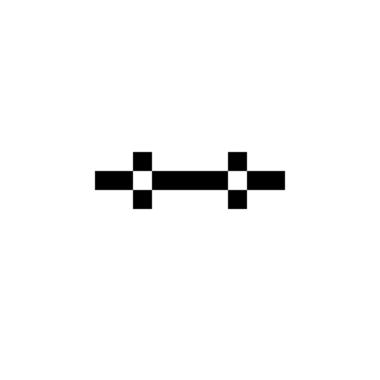
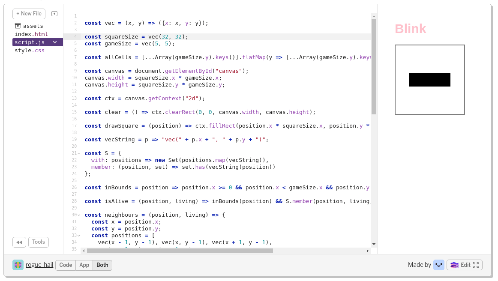

# Praktisk Game of Life i nettleseren

*After Hours hos Computas torsdag 28. mars.*

Praktisk @ After Hours er et fast arrangement på After Hours hvor vi løser en liten praktisk programmeringsoppgave. Oppgaven kan løses alene eller i små grupper, alt etter hva man selv foretrekker. Etter vi har programmert tar vi en liten titt på hva vi har laget. Hva vi har gjort likt og hva vi har gjort forskjellig? Forhåpentligvis lærer vi alle noe lurt som vi kan ta med oss videre.

## Grafikk, nå også i nettleseren!

De fleste har nok fått med seg at nettleseren ikke lenger bare er for visning av dokumenter, men også har blitt en plattform for grafisk programmering. I denne runden av Praktisk @ After Hours skal vi se litt på klassikeren Conway's Game of Life, og hvordan man kan lage dette grafiske spillet i nettleseren ved hjelp av Canvas APIet.

Denne gangen har vi gjort klar litt JavaScript, HTML og CSS som man kan ta utgangspunkt i hvis man har lyst, men som alltid på Praktisk er det mulig å gjøre litt hva man vil uten å følge opplegget slavisk.

Ta med deg laptopen og bli med! Du trenger ikke å forberede deg, lese resten av denne guiden, eller installere noe på forhånd for å delta.

## Conway's Game of Life

Conway's Game of Life, populært kalt Game of Life, eller bare Life, er en cellulær automat med ganske enkle regler og ganske fin oppførsel.

Du kan tenke på Life som et spill som spilles på et rutenett der hver rute er en "celle". En celle er enten levende eller død. Er en celle levende, markerer man det typisk ved å fargelegge ruten cellen bor i. Vi fargelegger cellen med svart i våre eksempler. Er cellen død fargelegger man ikke ruten.

Man starter spillet ved å plassere ut noen levende celler i rutenettet. Så fortsetter spillet ved at man hver runde oppdaterer alle cellene/rutene basert på tilstanden til hver celle/rute og tilstanden til de åtte nabo-cellene/rutene. For å bestemme om en celle/rute er levende eller død i neste runde av spillet (generasjon) bruker man følgende fire regler:

1. En levende celle med færre enn to levende naboer dør.
2. En levende celle med to eller tre levende naboer overlever.
3. En levende celle med flere enn tre levende naboer dør.
4. En død celle med nøyaktig tre levende naboer blir levende.

### Blink, et eksempel på Life

Blink er et klassisk eksempel på en oscillator, som er et mønster som repeterer seg selv etter et bestemt antall runder/generasjoner. Her starter vi med tre levende celler på en linje (C1, C2 og C3), enten horisontalt eller vertikalt.

| _ | _  | _  | _  | _ |
|:-:|:--:|:--:|:--:|:-:|
| _ | _  | _  | _  | _ |
| _ | C1 | C2 | C3 | _ |
| _ | _  | _  | _  | _ |
| _ | _  | _  | _  | _ |

C1 og C3 har bare en levende nabo (C2), og kommer til å dø i neste runde/generasjon. C2 har akkurat to levende naboer (C1 og C3) og kommer til å overleve neste runde. I tillegg har de tomme rutene rett over og rett under C2 akkurat tre levende naboer, og kommer til å bli levende. Etter en runde har vi med andre ord et brett som ser slik ut:

| _ | _  | _  | _  | _ |
|:-:|:--:|:--:|:--:|:-:|
| _ | _  | C4 | _  | _ |
| _ | _  | C2 | _  | _ |
| _ | _  | C5 | _  | _ |
| _ | _  | _  | _  | _ |

C1 og C3 er døde, og er ikke lenger markert på brettet. C2 har overlevd og i tillegg har C4 og C5 flyttet inn på de rutene som hadde akkurat tre levende naboer i forrige runde. Det samme mønsteret gjentar seg neste runde, og vi kommer tilbake til det mønsteret vi startet med.

### Mønstre i Life kan bli ganske kompliserte

Blink er et av de enkleste eksemplene, men mønstrene og oppførslene som kan oppstå kan være ganske kompliserte. Man har til og med funnet ut at man kan lage Turing-komplette maskiner med mønstre i Life! Under er pentadecathlon, et eksempel på en mer omfattende oscillator.

## Hvor starter jeg nå?

Vi har gjort klar et utgangspunkt for å programmere Game og Life i ren JavaScript, HTML og CSS. Du kan velge mellom å utvikle rett i nettleseren ved hjelp av [Glitch](https://glitch.com/), eller jobbe lokalt med dine egne favoritt-verktøy.

Vil du jobbe lokalt kloner du [repoet med utgangspunkt-koden](https://github.com/cx-praktisk/game-of-life), åpner index.html i en passende nettleser, og redigerer script.js i en editor du liker.

Hvis du vil bruke Glitch er det lurt å begynne med å opprette en bruker hvis du ikke har fra før. Deretter kan du trykke på remix-knappen på [prosjektet med utgangspunkt-koden](https://glitch.com/~praktisk-game-of-life), og begynne å kode. Du kan se kode og resultat samtidig, eller du kan bruke show-knappen for å se resultatet i en egen fane. Under er et utsnitt av hvordan utvikling i Glitch ser ut.

### Kort om utgangspunkt-koden

Nei.

Eller, se heller kommentarene i `script.js`-filen.

### Litt om utvikling i nettleseren

Nettleseren din er antageligvis nesten et utviklingsmiljø med en ganske fin REPL og god støtte for å gjøre endringer live i en "kjørende" nettside. Det kan være et fint sted å prøve seg fram før man "fører inn" endringene sine i filen man jobber med.

Ting er litt avhengige av nettleseren du bruker, men det er ganske sannsynlig at `F12` gir deg tilgang til bl.a. en JavaScrip-"Console."

Utgangspunkt-koden vår har en liste, `colours`, med farger. Det tegnes en firkant for hver farge. Vi kan f.eks. legge til et par farger og se om det blir flere firkanter:

    colours.push("#00FFFF");    
    colours.push("#FFFF00");

Eller vi kan gjøre enkle endringer i den "vanlige" HTMLen, som å endre litt på teksten som vises over HTML-canvaset. F.eks.:

    const header = document.getElementsByTagName("header")[0];
    header.getElementsByTagName("h1")[0].innerText = "Laff";
    const p = document.createElement("p");
    p.innerText = "Hei";
    header.appendChild(p);

Prøv deg gjerne fram litt. Nettleseren ganske er flink til å peke ut hvilke elementer i nettsiden du jobber med, og hjelper til med code completion og det ene og det andre :)

## Bla bla bla, diverse og etc.

Gode og dårlige tips, ting det går an å tenke på, ting det går an å la være å tenke på, og sånn..

### Algoritmer og datastrukturer

Å implementere Life er ikke en veldig stor oppgave, men den er stor nok til at det går an å gjøre ganske forskjellige designvalg. Det kan være interessant å tenke litt på noe av følgende: Er en tilstand en todimensjonal array, en liste med posisjonene til levende celler, eller noe helt annet? Hva er en celle? Har brettet gitte dimensjoner eller er det uendelig stort? Er et steg i tid en ren funksjon som gir deg en ny tilstand som returverdi, eller en prosedyre som modifiserer en “nå-tilstand?”

Gjør gjerne valg som virker lure. Eller, hvis du kjenner Life fra før og har implementert det tidligere, så er det kanskje gøy å prøve noe mindre lurt denne gangen…

### `map` og `filter` og `forEach` og litt sånt finnes

Du får en og annen nyttig metode med i JavaScript. Hvis du ikke har lyst til å for-løkke det til, så fungerer ting som `[1, 2, 3].map(x => x + x)` ganske slik en kan forvente...

### `function` eller `=>`

Liker du

    function foo(x) {
      return x + x;
    }

eller

    const foo = x => x + x;

best? Velg selv :)

### Enn om jeg vil trykke på noe?

Det er flere `onmouse-et-eller-annet`-greier du kan gjøre ting med hvis du har lyst til å gjøre et-eller-annet med musepeking og sånt. Her er et lite eksempel som kan brukes for å komme i gang der vi skriver ut koordinatene til cellen du trykker på:

    canvas.onmousedown = evt => {
      const rect = canvas.getBoundingClientRect();
      const x = ~~((evt.clientX - rect.left) / cellSize.x);
      const y = ~~((evt.clientY - rect.top) / cellSize.y);
      console.log(vec(x, y));
    }

Test det gjerne ut rett i JavaScript-konsollen.

### Noen steder er det drager

Du kommer langt med de primitive typene, arrays og enkle JavaScript-"objekter" som brukes mer som rene datastrukturer, og litt funksjoner. Og det er kanskje en del av språket som ikke er full av overraskelser.

Det vil si: Hvis bruk av `class` og `this` og den slags virker litt skummelt: Det burde ikke være nødvendig for å løse oppgaven, så kan godt la være :)

### For primitive typer: Sammenlign gjerne med `===`

`==` er litt sånn som legger hodet på skakke og myser litt og sier at ja, de to tingene ser ganske like ut. `===` er litt strengere og passer bedre i hvert fall for de av oss som tenker at `1` og `"1"` er ganske forskjellige ting.

### For andre ting: Sammenlign gjerne på annet vis
JavaScript synes kanskje ikke `[1, 2, 3]` er lik `[1, 2, 3]`, eller `{ x: 5, y: 9 }` er lik `{ x: 5, y: 9 }`, enten du bruker `==` eller `===`. Det vil si, for arrayer og andre objekter sjekker den om det er samme instans, ikke om to instanser "inneholder det samme" eller noe slikt. Lag egne sammenligningsfunksjoner ved behov.

Og hvis du har lyst til f.eks. å putte litt ting i et [Set](https://developer.mozilla.org/en-US/docs/Web/JavaScript/Reference/Global_Objects/Set) kan det være greit å holde seg til primitive typer, f.eks. ved å gjøre om objekter til egnede stringer før du putter de i settet. Eller noe.
