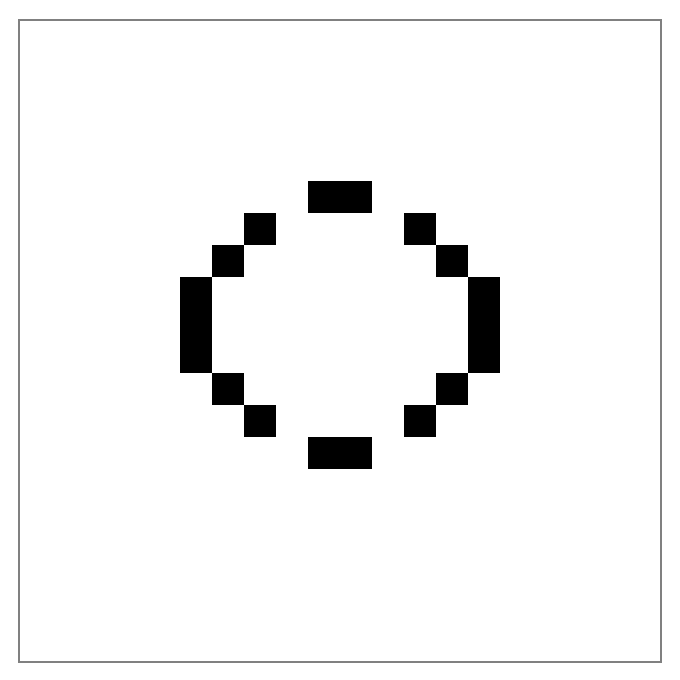
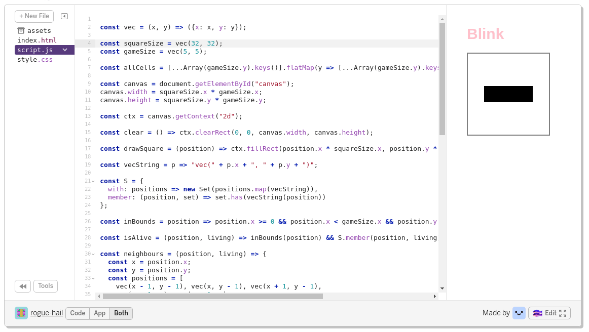

# Praktisk Game of Life i nettleseren

Praktisk @ After Hours er et fast arrangement på After Hours hvor vi løser en liten praktisk programmeringsoppgave. Oppgaven kan løses alene eller i små grupper, alt etter hva man selv foretrekker. Etter vi har programmert tar vi en liten titt på hva vi har laget. Hva vi har gjort likt og hva vi har gjort forskjellig? Forhåpentligvis lærer vi alle noe lurt som vi kan ta med oss videre.

## Grafikk, nå også i nettleseren!

De fleste har nok fått med seg at nettleseren ikke lenger bare er for visning av dokumenter, men også har blitt en plattform for grafisk programmering. I denne runden av Praktisk @ After Hours skal vi se litt på klassikeren Conway's Game of Life, og hvordan man kan lage dette grafiske spillet i nettleseren ved hjelp av Canvas APIet.

Denne gangen har vi gjort klar litt JavaScript, HTML og CSS som man kan ta utgangspunkt i hvis man har lyst, men som alltid på Praktisk er det mulig å gjøre litt hva man vil uten å følge opplegget slavisk.

Ta med deg laptopen og bli med! Du trenger ikke å forberede deg eller installere noe på forhånd for å delta.

## Conway's Game of Life

Conway's Game of Life, populært kalt Game of Life, eller bare Life, er en cellulær automat med ganske enkle regler og ganske fin oppførsel.

Du kan tenke på Life som et spill som spilles på et rutenett der hver rute er en "celle". En celle er enten levende eller død. Er en celle levende, markerer man det typisk ved å fargelegge ruten cellen bor i. Vi fargelegger cellen med svart i våre eksempler. Er cellen død fargelegger man ikke ruten.

Man starter spillet ved å plassere ut noen levende celler i rutenettet. Så fortsetter spillet ved at man hver runde oppdaterer alle cellene/rutene basert på tilstanden til hver celle/rute og tilstanden til de åtte nabo-cellene/rutene. For å bestemme om en celle/rute er levende eller død i neste runde av spillet (generasjon) bruker man følgende fire regler:

1. En levende celle med færre enn to levende naboer dør.
2. En levende celle med to eller tre levende naboer overlever.
3. En levende celle med flere enn tre levende naboer dør.
4. En død celle med nøyaktig tre levende naboer blir levende.

### Blink, et eksempel på Life

Blink er et klassisk eksempel på en oscillator, som er et mønster som repeterer seg selv etter et bestemt antall runder/generasjoner. Her starter vi med tre levende celler på en linje (C1, C2 og C3), enten horisontalt eller vertikalt.

| _ | _  | _  | _  | _ |
|:-:|:--:|:--:|:--:|:-:|
| _ | _  | _  | _  | _ |
| _ | C1 | C2 | C3 | _ |
| _ | _  | _  | _  | _ |
| _ | _  | _  | _  | _ |

C1 og C3 har bare en levende nabo (C2), og kommer til å dø i neste runde/generasjon. C2 har akkurat to levende naboer (C1 og C3) og kommer til å overleve neste runde. I tillegg har de tomme rutene rett over og rett under C2 akkurat tre levende naboer, og kommer til å bli levende. Etter en runde har vi med andre ord et brett som ser slik ut:

| _ | _  | _  | _  | _ |
|:-:|:--:|:--:|:--:|:-:|
| _ | _  | C4 | _  | _ |
| _ | _  | C2 | _  | _ |
| _ | _  | C5 | _  | _ |
| _ | _  | _  | _  | _ |

C1 og C3 er døde, og er ikke lenger markert på brettet. C2 har overlevd og i tillegg har C4 og C5 flyttet inn på de rutene som hadde akkurat tre levende naboer i forrige runde. Det samme mønsteret gjentar seg neste runde, og vi kommer tilbake til det mønsteret vi startet med.

### Mønstre i Life kan bli ganske kompliserte

Blink er et av de enkleste eksemplene, men mønstrene og oppførslene som kan oppstå kan være ganske kompliserte. Man har til og med funnet ut at man kan lage Turing-komplette maskiner med mønstre i Life! Under er pentadecathlon, et eksempel på en mer omfattende oscillator.

## I nettleseren

Vi vil implementere Game of Life med *litt* HTML og CSS, og med litt mer JavaScript-programmering. Og vi vil gjøre ganske "ren" JavaScript-programmering, uten ekstra biblioteker og rammeverk; det viser seg at det ikke skal skrekkelig mye til å tegne litt bilder i nettleseren mer på egenhånd (smil)

Vi starter med litt ferdig-kode:

* Antageligvis all HTMLen og CSSen vi trenger
* Litt JavaScript-kode
  * Oppsett av canvas og litt eksempel-funksjoner for å tegne ting
  * Ikke noe implementasjon av Game of Life

Og programmerer videre derfra...

## Hvor starter jeg nå?

Vi har gjort klar et utgangspunkt for å programmere Game og Life i ren JavaScript, HTML og CSS. Du kan velge mellom å utvikle rett i nettleseren ved hjelp av [Glitch](https://glitch.com/), eller jobbe lokalt med dine egne favoritt-verktøy.

Vil du jobbe lokalt kloner du [repoet med utgangspunkt-koden](https://github.com/cx-praktisk/game-of-life), åpner index.html i en passende nettleser, og redigerer script.js i en editor du liker.

Hvis du vil bruke Glitch er det lurt å begynne med å opprette en bruker hvis du ikke har fra før. Deretter kan du trykke på remix-knappen på [prosjektet med utgangspunkt-koden](https://glitch.com/~praktisk-game-of-life), og begynne å kode. Du kan se kode og resultat samtidig, eller du kan bruke show-knappen for å se resultatet i en egen fane. Under er et utsnitt av hvordan utvikling i Glitch ser ut.

